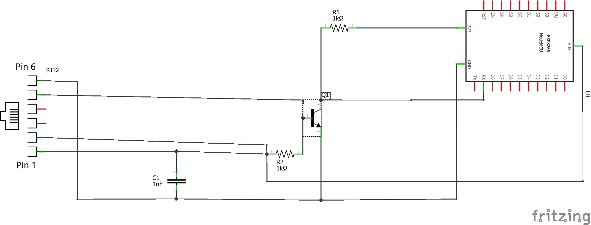
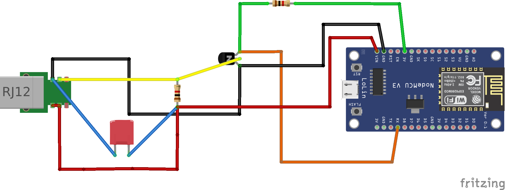
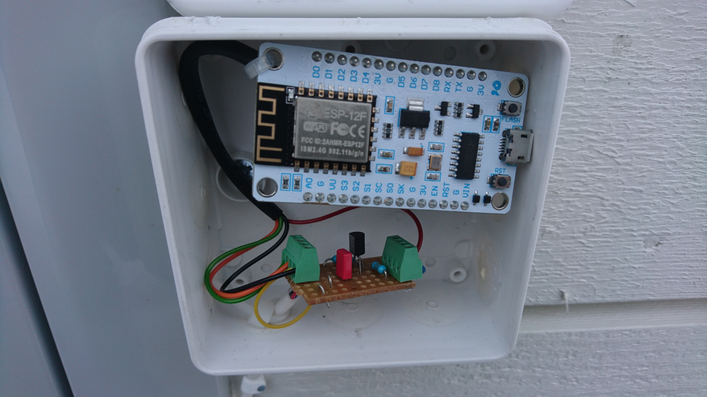
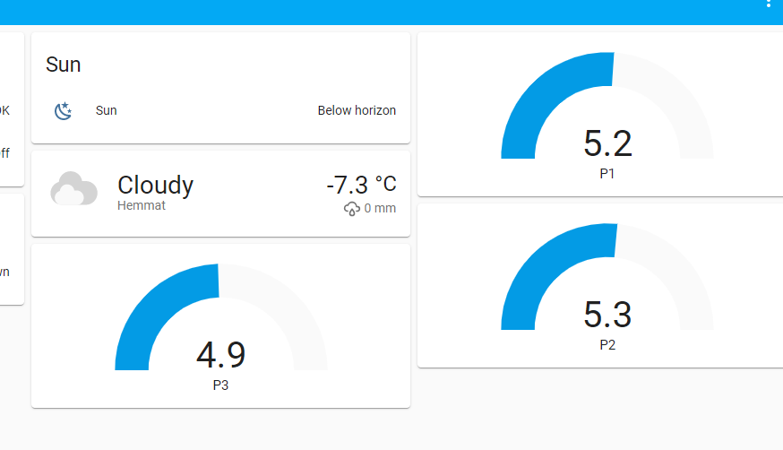

# esp-smart-meter
A reliable ESP8266 application to read out data from COSEM/DLMS based smart meters using OBIS code/structure.

<!-- vscode-markdown-toc -->
* [Background](#Background)
* [Architecture](#Architecture)
* [Hardware](#Hardware)
	* [RJ45](#RJ45)
	* [RJ12](#RJ12)
* [Installation](#Installation)
	* [Download firmware](#Downloadfirmware)
	* [Setup](#Setup)
	* [Integrate to home automation server (HAS)](#IntegratetohomeautomationserverHAS)
		* [Home assistant](#Homeassistant)
		* [openHAB](#openHAB)
* [If anything goes wrong](#Ifanythinggoeswrong)

<!-- vscode-markdown-toc-config
	numbering=false
	autoSave=true
	/vscode-markdown-toc-config -->
<!-- /vscode-markdown-toc -->

## <a name='Background'></a>Background
Being able to read out user data from different utility meters in your household is being introduced in many European countries. 
For electricity metering the Netherlands and Norway are among the pioneers both basing the meters on the COSEM/DLMS standard. These countries have chosen different hardware interfaces though. The Dutch standard send serial data over UART with a RJ12 interface on their electricity meters, whereas the Norwegians send serial data over a M-Bus interface with a RJ45 connector on their meters. Common names for the user interface port are H1, P1 or HAN-port.

The purpose of this project is to make an application for use on the Swedish market, but it should be possible to use it on any smart meter following the COSEM/DLMS standard. So this software should be compatible with Norwegian and Dutch smart meters or any smart meter using this standard.

In Sweden smart meters are supposed to follow the Dutch standard, but initially smart meters in Sweden were compatible to the Norwegian standard. So there exist a mixture of smart meters in Sweden adhering to different standars.

Also many implementations on github are custom built to the specific meter that particular user happened to have. As the meter data is structured, similar to for example json data, the goal of this project is to write an application that parse serial data from any smart meter to json format.

## <a name='Architecture'></a>Architecture
The basic idea is to use an NodeMCU which have the ESP8266 chip, any ESP-chip should work as the needed functionality is one serial RX-pin and WiFi-connectivity.

Serial data from the HAN-port is sent at 115200 baud, a message of 512 bytes would then take 40 ms to receive. This has to be accounted for when using the ESP8266 chip which has a default serial buffer size of 256 bytes. If the serial buffer is not read in within 20 ms it will be full and data will be lost. If too much time is spent on serving the webserver it might cause buffer overrun. In this project the serial buffer is increased to 4096 bytes to ensure there will be space for the data, and minimize the risk of overrun.

The basic design principle is to have a major schedule frame checking the serial buffer during each cycle and save data to a json-file which is accessible from the web interface. Then there are minor frames to do other tasks when there are no serial data to process.

When data is received it is parsed to a data.json file accessible from the web interface. This data.json file can then be fetched by a home automation server of any flavour.

Other functionality is mDNS to make the server accessible by hostname, for example http://emeter/ instead of ip address http://192.168.1.233
This does not work on all OS'es and webbrowsers.

A hard reset functions is bound to the flash button/input. If held for 5 seconds it will erase settings and reset the chip.

OTA functionality available, WARNING, no security features are implemented as the project assumes that the MCU is on protected local network.

For first time setup and connection to your local WiFi the chip will act as a access point which can be connected to from a mobile phone. 

If data cannot be parsed correctly, failed data will be dumped to a log.txt file accessible through the web interface.

This project aims to function with any smart meter, existing and future. No meter specific functionality is designed into the code other than parsing data either from the A-XDR (Norwegian standard) format or ASCII (Dutch standard) format. Adaptations to a specific meter is done in the Home Automation system reading the data.

## <a name='Hardware'></a>Hardware
The serial input cannot be connected directly to the HAN-port, some HW is required inbetween. 

Usually you need to contact your electricity provider to enable the HAN-port before you'll be able to readout data.

If the electricity meter is placed inside a grounded metal cabinet you might consider to place the chip outside of the cabinet as radio signals are attenuated by metal boxes.
### <a name='RJ45'></a>RJ45
The norwegian standard use a RJ45 connector and send data over M-Bus. This bus use the same pin for data and power supply. There is also an additional ground pin. Thus, even though the RJ45 have 8 pins, only 2 are used. There is a chip that can be used for M-Bus applications: TSS721. This project is not tested with this HW-interface, you may find ideas how to use this chip here: https://github.com/roarfred/AmsToMqttBridge/tree/master/Electrical

### <a name='RJ12'></a>RJ12
RJ11 is the connector that is used for those rare landline telephones still in service. It has 6 pin positions but only 4 electrical pins, RJ12 is the same size but it has 6 electrical pins. Make sure you get RJ12 connecter as the extra pins are needed! Actually only 4 pins would be enough but the required pins are at the edges so that's why you need the RJ12. In the specification, 5 pins are defined but 2 of these are ground, so one of these could be skipped. This enables the use of a 4 wire telephone cable.

The pins are as this:

1. 5 V power supply
2. Data request, short this pin to 5 V to request data continously.
3. Power ground
4. Not used
5. Data, open collector
6. Data ground

Pin 5 being an open collector means that a logical 1 will be equal to connection to ground, whereas a logical 0 will be floating. Another complication to this is that the ESP8266 only works with max 3.3 V on its RX-input. The NodeMCU has a voltage regulator so you can power it with the 5 V pin. But if you use a bare ESP-chip you need a voltage regulator to step down the power to 3.3 V. In order to invert and step down the data signal you need a NPN-transistor, 2 resistors and a capacitance. The capacitance is optional, but it is good practice to have one on the power supply input to reduce current spikes when the ESP is transmitting.
Below is a schematic and an example the setup.




## <a name='Installation'></a>Installation

### <a name='Downloadfirmware'></a>Download firmware

The project use Platformio. To use, do this:
- Install Visual Code 
- Add the Platformio extension to Visual Code
- Open this this project folder i Visual Code

The project is based on the NodeMCU but most ESP-modules should work with minor tweaks. To upload using USB-cable make sure the OTA is disabled by commenting these lines in ```platformio.ini``` like this:
```
;upload_protocol = espota
;upload_port = 192.168.1.233
```

After first upload, the above lines may be uncommented to enable OTA. Note that you need to set the correct ip-address.

### <a name='Setup'></a>Setup
First time the ESP powered it will enter WiFi AP mode. Search for the ESP on a phone and connect to its network. The blue LED will blink slowly to indicate AP-mode.


Enter the credentials for you local network. You may also be able to set a local hostname that the ESP be available on, default is http://emeter

The ESP will then restart and connect to you local network. If it fails for any reason it will reenter AP-mode.
The credentials will be stored and kept even if the ESP is flashed with new firmware. To reset the settings, press and hold the flash button for 5 seconds.

### <a name='IntegratetohomeautomationserverHAS'></a>Integrate to home automation server (HAS)
Examples on how to integrate the data into your HAS is shown for Home assistant and OpenHab, but it should work for any HAS capable of reading json.

What the data means is defined in the manual for your specific meter. But in general, each data set starts with an OBIS code consisting of 5 or 6 values in the range 0 to 255, typically it may look like this on hexadecimal form: 01.02.03.04.05.FF

If the ESP is receiveing valid data it will publish the data on http://emeter, it aint pretty but it is only meant to be used to get a human readable form of the json data. Nice graphics is better suited for your HAS to take care of.


The above has more readabilty than the source of the data which is available on http://emeter/data.json:
```
{"elapsedtime":546471306,"rssi":-84,"mac":"60:01:94:73:67:CF","localip":"192.168.1.233","ssid":"Lingonet2","header":{"frameformat":3,"segmentation":0,"datalength":579,"client":65,"server":2179,"control":19,"hcs":"0XEB85","fcs":"0XBE70","llc":"0XE6E700"},"apdu":{"tag":15,"liiap":"0X40000000","datetime":"00"},"payload0XEB85":[[["0000010000FF","07E5011C04131914FF8000FF"],["0100010700FF",1106,[0,"W"]],["0100020700FF",0,[0,"W"]],["0100030700FF",0,[0,"var"]],["0100040700FF",407,[0,"var"]],["01001F0700FF",18,[-1,"A"]],["0100330700FF",23,[-1,"A"]],["0100470700FF",20,[-1,"A"]],["0100200700FF",2345,[-1,"V"]],["0100340700FF",2350,[-1,"V"]],["0100480700FF",2353,[-1,"V"]],["0100150700FF",311,[0,"W"]],["0100160700FF",0,[0,"W"]],["0100170700FF",0,[0,"var"]],["0100180700FF",284,[0,"var"]],["0100290700FF",502,[0,"W"]],["01002A0700FF",0,[0,"W"]],["01002B0700FF",222,[0,"var"]],["01002C0700FF",0,[0,"var"]],["01003D0700FF",288,[0,"W"]],["01003E0700FF",0,[0,"W"]],["01003F0700FF",0,[0,"var"]],["0100400700FF",369,[0,"var"]],["0100010800FF",3108526,[0,"Wh"]],["0100020800FF",0,[0,"Wh"]],["0100030800FF",380,[0,"varh"]],["0100040800FF",1005168,[0,"varh"]]]]}
```

#### <a name='Homeassistant'></a>Home assistant

To integrate into home assistant you need to add a few lines to ```configuration.yaml```. How to edit this file is described here: https://www.home-assistant.io/getting-started/configuration/ 

The first reading relates to the red circle and the second reading relates to the blue circles in the image above. The values are divided by 1000 to get kW and kvar respectively.

```yaml
sensor:
  - platform: rest
    resource: http://emeter.local/data.json
    name: electricity_meter
    scan_interval: 10
    value_template: 'OK'
    json_attributes:
      - payload0XEB85
  - platform: template
    sensors:
      active_energy_import:
        friendly_name: 'Active energy import'
        value_template: '{{ states.sensor.electricity_meter.attributes["payload0XEB85"][0][1][1] | float/1000 }}'
      reactive_energy_export:
        friendly_name: 'Reactive energy export'
        value_template: '{{ states.sensor.electricity_meter.attributes["payload0XEB85"][0][4][1] | float/1000 }}'
```

Save the file and restart your Home assistant server. You should now be able to add your integrations:


#### <a name='openHAB'></a>openHAB

To get this working with OpenHAB you need some add-ons. This was tested with 2.4.0, although version 3.0.0 is available, the method should be the same. How add-on are added is described here: https://www.openhab.org/docs/configuration/addons.html
The following add-on are required:
- HTTP Binding
- JSONPath Transformation
- Javascript Transformation (optional, only needed for conversion of values, division etc)

The default location for configuration files are ```/etc/openhab2``` if you use the openhabian distribution for Raspberry Pi.

Add the following to ```services/http.cfg```:
```
# timeout in milliseconds for the http requests (optional, defaults to 5000)
timeout=5000

# the interval in milliseconds when to find new refresh candidates
# (optional, defaults to 1000)
granularity=5000

# whether to substitute the current time or state value into the URL
# (optional, defaults to true)
format=true

# configuration of the first cache item
emeter.url=http://emeter/data.json
emeter.updateInterval=10000
```

Create a new items file ```items/emeter.items``` with the below content. The first item relates to the red circles and the second line to the blue circles in the image above.
```
Number Total_Active_Power_In "Total active power import: [JS(divideBy1000.js):%s kW]" <energy> { http="<[emeter:100:JSONPATH($.payload0XEB85[0][1][1])]" }
Number Total_Reactive_Power_Out "Total reactive power export: [JS(divideBy1000.js):%s kvar]" <energy> { http="<[emeter:100:JSONPATH($.payload0XEB85[0][4][1])]" }
```

You also need to create the javascript file ```transform/divideBy1000.js``` if you need to convert the value from W to kW for example:
```javascript
(function(i) {
    var res = i.split(" "); //divide value and unit
    var value = res[0] / 1000;
    return value.toFixed(1) + " " + res[1];
})(input)
```

Voila, the changes should take effect immediately. Here is data from openhab visualized in Grafana (data is stored and fetched from an influxdatabase):


## <a name='Ifanythinggoeswrong'></a>If anything goes wrong

The ESP will store raw data packages that cannot be read for whatever reason. These are available at http://emeter/log.txt

Paste the data if you create an issue for the esp-smart-meter.


Example of a broken message:
```
--- Start ---
0x1b, 0x02, 0x03, 0x09, 0x06, 0x01, 0000, 0x17, 0x07, 0000, 0xff, 0x06, 0000, 0000, 0000, 0000, 
0x02, 0x02, 0x0f, 0000, 0x16, 0x1d, 0x02, 0x03, 0x09, 0x06, 0x01, 0000, 0x18, 0x07, 0000, 0xff, 
0x06, 0000, 0000, 0x01, 0x1e, 0x02, 0x02, 0x0f, 0000, 0x16, 0x1d, 0x02, 0x03, 0x09, 0x06, 0x01, 
0000, 0x29, 0x07, 0000, 0xff, 0x06, 0000, 0000, 0x01, 0xf5, 0x02, 0x02, 0x0f, 0000, 0x16, 0x1b, 
0x02, 0x03, 0x09, 0x06, 0x01, 0000, 0x2a, 0x07, 0000, 0xff, 0x06, 0000, 0000, 0000, 0000, 0x02, 
0x02, 0x0f, 0000, 0x16, 0x1b, 0x02, 0x03, 0x09, 0x06, 0x01, 0000, 0x2b, 0x07, 0000, 0xff, 0x06, 
0000, 0000, 0000, 0xcb, 0x02, 0x02, 0x0f, 0000, 0x16, 0x1d, 0x02, 0x03, 0x09, 0x06, 0x01, 0000, 
0x2c, 0x07, 0000, 0xff, 0x06, 0000, 0000, 0000, 0000, 0x02, 0x02, 0x0f, 0000, 0x16, 0x1d, 0x02, 
0x03, 0x09, 0x06, 0x01, 0000, 0x3d, 0x07, 0000, 0xff, 0x06, 0000, 0000, 0000, 0xd0, 0x02, 0x02, 
0x0f, 0000, 0x16, 0x1b, 0x02, 0x03, 0x09, 0x06, 0x01, 0000, 0x3e, 0x07, 0000, 0xff, 0x06, 0000, 
0000, 0000, 0000, 0x02, 0x02, 0x0f, 0000, 0x16, 0x1b, 0x02, 0x03, 0x09, 0x06, 0x01, 0000, 0x3f, 
0x07, 0000, 0xff, 0x06, 0000, 0000, 0000, 0000, 0x02, 0x02, 0x0f, 0000, 0x16, 0x1d, 0x02, 0x03, 
0x09, 0x06, 0x01, 0000, 0x40, 0x07, 0000, 0xff, 0x06, 0000, 0000, 0x01, 0x29, 0x02, 0x02, 0x0f, 
0000, 0x16, 0x1d, 0x02, 0x03, 0x09, 0x06, 0x01, 0000, 0x01, 0x08, 0000, 0xff, 0x06, 0000, 0x2e, 
0xeb, 0x88, 0x02, 0x02, 0x0f, 0000, 0x16, 0x1e, 0x02, 0x03, 0x09, 0x06, 0x01, 0000, 0x02, 0x08, 
0000, 0xff, 0x06, 0000, 0000, 0000, 0000, 0x02, 0x02, 0x0f, 0000, 0x16, 0x1e, 0x02, 0x03, 0x09, 
0x06, 0x01, 0000, 0x03, 0x08, 0000, 0xff, 0x06, 0000, 0000, 0x01, 0x74, 0x02, 0x02, 0x0f, 0000, 
0x16, 0x20, 0x02, 0x03, 0x09, 0x06, 0x01, 0000, 0x04, 0x08, 0000, 0xff, 0x06, 0000, 0x0f, 0x22, 
0x66, 0x02, 0x02, 0x0f, 0000, 0x16, 0x20, 0xa0, 0x84, 0x7e, 
---  End  ---
```


